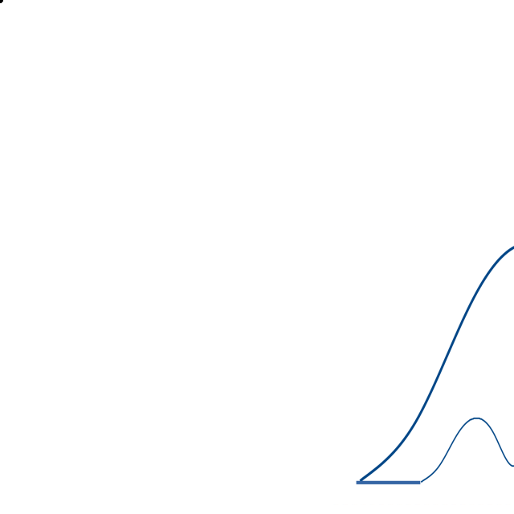

# Harmonic

[](https://github.com/astro-informatics/harmonic)
[](https://travis-ci.com/astro-informatics/harmonic)
[](https://astro-informatics.github.io/harmonic/)
[](https://codecov.io/gh/astro-informatics/harmonic)
[](https://github.com/astro-informatics/harmonic/blob/master/LICENSE.txt)
[](https://github.com/astro-informatics/harmonic/blob/master/LICENSE_EXT.txt)
[](https://arxiv.org/abs/20XX.XXXXX)





## Installation

### Set up conda environment

```conda create --name harmonic python=3.8.0```

### Install dependencies and build Harmonic

`bash getting_started.sh`

Run tests

`pytest`

Run examples

From within the harmonic root directory

`python example/<example_name>`

e.g.

`python examples/rastrigin.py`


Make violin plots

`python examples/plot_realisations.py <evidence_inv_realisations> <evidence_inv_analytic>

e.g.

examples/data/rastrigin_evidence_inv_realisations.dat examples/data/rastrigin_evidence_inv_analytic.dat`

`python examples/plot_realisations.py examples/data/rastrigin_evidence_inv_realisations.dat examples/data/rastrigin_evidence_inv_analytic.dat`


### Build for code coverage and compute code coverage

`python setup.py build_ext --inplace --define CYTHON_TRACE`

`pytest --cov-report term --cov=harmonic --cov-config=.coveragerc`

## Make pip installable

'python setup.py bdist_wheel --universal'

'twine upload --repository-url https://test.pypi.org/legacy/ dist/*'

'pip install -i https://test.pypi.org/simple/ harmonic'


## License

harmonic is released under the GPL-3 license (see [LICENSE.txt](https://github.com/astro-informatics/harmonic/blob/master/LICENSE.txt)), subject to the non-commercical use condition (see [LICENSE_EXT.txt](https://github.com/astro-informatics/harmonic/blob/master/LICENSE_EXT.txt))

     harmonic
     Copyright (C) 2021 Jason McEwen & contributors

     This program is released under the GPL-3 license (see LICENSE.txt), 
     subject to a non-commercical use condition (see LICENSE_EXT.txt).

     This program is distributed in the hope that it will be useful,
     but WITHOUT ANY WARRANTY; without even the implied warranty of
     MERCHANTABILITY or FITNESS FOR A PARTICULAR PURPOSE.
