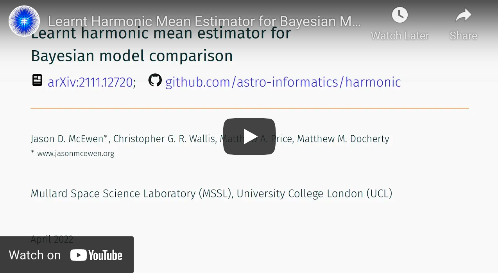

.. |github| image:: https://img.shields.io/badge/GitHub-harmonic-brightgreen.svg?style=flat
    :target: https://github.com/astro-informatics/harmonic
.. |tests| image:: https://github.com/astro-informatics/harmonic/actions/workflows/python.yml/badge.svg
    :target: https://github.com/astro-informatics/harmonic/actions/workflows/python.yml
.. |docs| image:: https://readthedocs.org/projects/ansicolortags/badge/?version=latest
    :target: https://astro-informatics.github.io/harmonic/
.. |codecov| image:: https://codecov.io/gh/astro-informatics/harmonic/branch/main/graph/badge.svg?token=1s4SATphHV
    :target: https://codecov.io/gh/astro-informatics/harmonic
.. |pypi| image:: https://badge.fury.io/py/harmonic.svg
    :target: https://badge.fury.io/py/harmonic
.. |licence| image:: https://img.shields.io/badge/License-GPL-blue.svg
    :target: http://perso.crans.org/besson/LICENSE.html
.. |arxiv1| image:: http://img.shields.io/badge/arXiv-2111.12720-orange.svg?style=flat
    :target: https://arxiv.org/abs/2111.12720
.. |arxiv2| image:: http://img.shields.io/badge/arXiv-2207.04037-orange.svg?style=flat
    :target: https://arxiv.org/abs/2207.04037
.. |arxiv3| image:: http://img.shields.io/badge/arXiv-2307.00048-orange.svg?style=flat
    :target: https://arxiv.org/abs/2307.00048
.. |arxiv4| image:: http://img.shields.io/badge/arXiv-2405.05969-orange.svg?style=flat
    :target: https://arxiv.org/abs/2405.05969
.. .. image:: https://img.shields.io/pypi/pyversions/harmonic.svg
..     :target: https://pypi.python.org/pypi/harmonic/

|github| |tests| |docs| |codecov| |pypi| |licence| |arxiv1| |arxiv2| |arxiv3| |arxiv4|

.. |logo| image:: ./docs/assets/harm_badge_simple.svg
    :width: 32
    :height: 32
    :align: center

|logo| Harmonic
=================================================================================================================

``harmonic`` is an open source, well tested and documented Python implementation of the *learnt harmonic mean estimator* (`McEwen et al. 2021 <https://arxiv.org/abs/2111.12720>`_) to compute the marginal likelihood (Bayesian evidence), required for Bayesian model selection.

For an accessible overview of the *learnt harmonic mean estimator* please see this `Towards Data Science article <https://towardsdatascience.com/learnt-harmonic-mean-estimator-for-bayesian-model-selection-47258bb0fc2e>`_.

While ``harmonic`` requires only posterior samples, and so is agnostic to the technique used to perform Markov chain Monte Carlo (MCMC) sampling, ``harmonic`` works exceptionally well with MCMC sampling techniques that naturally provide samples from multiple chains by their ensemble nature, such as affine invariant ensemble samplers.  We therefore advocate use of `harmonic` with the popular `emcee <https://github.com/dfm/emcee>`_ code implementing the affine invariant sampler of `Goodman & Weare (2010) <https://cims.nyu.edu/~weare/papers/d13.pdf>`_.

Basic usage is highlighted in this `interactive demo <https://colab.research.google.com/github/astro-informatics/harmonic/blob/main/notebooks/basic_usage.ipynb>`_. 

Overview video
==============

Installation
============

Brief installation instructions are given below (for further details see the `full installation documentation <https://astro-informatics.github.io/harmonic/user_guide/install.html>`_).  

Quick install (PyPi)
--------------------
The ``harmonic`` package can be installed by running

.. code-block:: bash
    
    pip install harmonic

Install from source (GitHub)
----------------------------
The ``harmonic`` package can also be installed from source by running

.. code-block:: bash

    git clone https://github.com/astro-informatics/harmonic
    cd harmonic

and installing within the root directory, with one command 

.. code-block:: bash

    pip install .

To check the install has worked correctly run the unit tests with 

.. code-block:: bash

    pytest 

To build the documentation from source run

.. code-block:: bash

    cd docs && make html

Then open ``./docs/_build/html/index.html`` in a browser.

Documentation
=============

Comprehensive  `documentation for harmonic <https://astro-informatics.github.io/harmonic/>`_ is available.

Contributors
============

`Jason D. McEwen <http://www.jasonmcewen.org/>`_, `Christopher G. R. Wallis <https://scholar.google.co.uk/citations?user=Igl7nakAAAAJ&hl=en>`_, `Matthew A. Price <https://cosmomatt.github.io/>`_, `Matthew M. Docherty <https://mdochertyastro.com/>`_, `Alessio Spurio Mancini <https://www.alessiospuriomancini.com/>`_, `Alicja Polanska <https://alicjaap.github.io/>`_.

Attribution
===========

Please cite `McEwen et al. (2021) <https://arxiv.org/abs/2111.12720>`_ if this code package has been of use in your project. 

A BibTeX entry for the paper is:

.. code-block:: 

     @article{harmonic, 
        author = {Jason~D.~McEwen and Christopher~G.~R.~Wallis and Matthew~A.~Price and Matthew~M.~Docherty},
         title = {Machine learning assisted {B}ayesian model comparison: learnt harmonic mean estimator},
       journal = {ArXiv},
        eprint = {arXiv:2111.12720},
          year = 2021
     }

Please *also* cite `Polanska et al. (2024) <https://arxiv.org/abs/2405.05969>`_ if using normalizing flow models.

A BibTeX entry for the paper is:

.. code-block::

    @misc{polanska2024learned,
        title={Learned harmonic mean estimation of the Bayesian evidence with normalizing flows}, 
        author={Alicja Polanska and Matthew A. Price and Davide Piras and Alessio Spurio Mancini and Jason D. McEwen},
        year={2024},
        eprint={2405.05969},
        archivePrefix={arXiv},
        primaryClass={astro-ph.IM}
    }

Please *also* cite `Spurio Mancini et al. (2022) <https://arxiv.org/abs/2207.04037>`_ if this code has been of use in a simulation-based inference project.

A BibTeX entry for the paper is:

.. code-block::

     @article{spurio-mancini:harmonic_sbi,
        author   = {A.~Spurio Mancini and M.~M.~Docherty and M.~A.~Price and J.~D.~McEwen},
        doi      = {10.1093/rasti/rzad051},
        eprint   = {arXiv:2207.04037},
        journal  = {{RASTI}, in press},
        title    = {{B}ayesian model comparison for simulation-based inference},
        year     = {2023}
     }

License
=======

``harmonic`` is released under the GPL-3 license (see `LICENSE.txt <https://github.com/astro-informatics/harmonic/blob/main/LICENSE.txt>`_), subject to 
the non-commercial use condition (see `LICENSE_EXT.txt <https://github.com/astro-informatics/harmonic/blob/main/LICENSE_EXT.txt>`_)

.. code-block::

     harmonic
     Copyright (C) 2021 Jason D. McEwen, Christopher G. R. Wallis, 
     Matthew A. Price, Matthew M. Docherty, Alessio Spurio Mancini, 
     Alicja Polanska & contributors

     This program is released under the GPL-3 license (see LICENSE.txt), 
     subject to a non-commercial use condition (see LICENSE_EXT.txt).

     This program is distributed in the hope that it will be useful,
     but WITHOUT ANY WARRANTY; without even the implied warranty of
     MERCHANTABILITY or FITNESS FOR A PARTICULAR PURPOSE.
