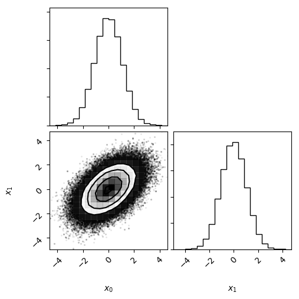
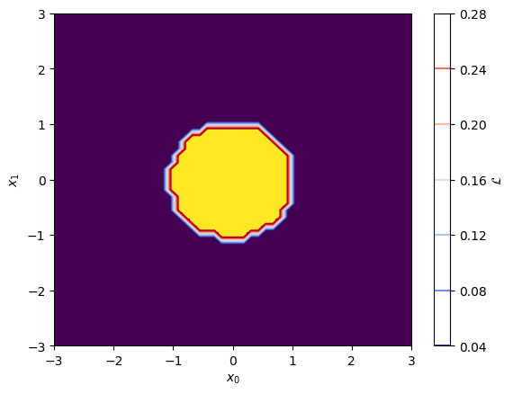
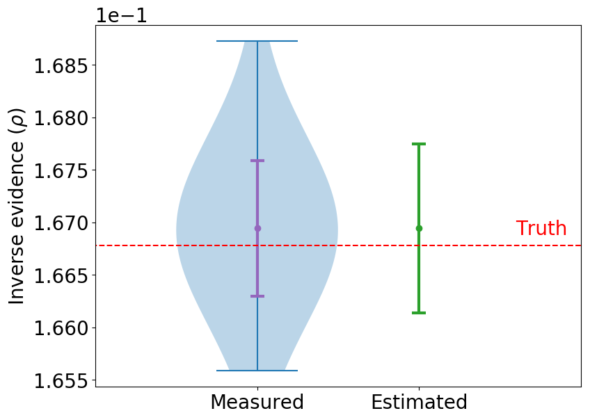
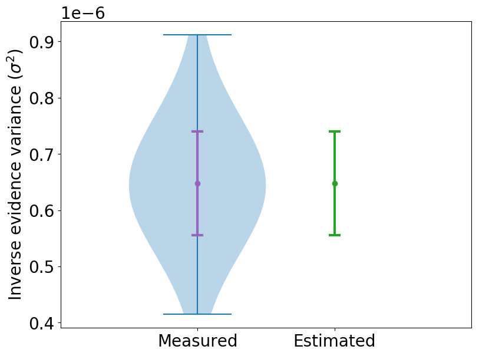

**************************
Numerical and Graphical Results
**************************
.. image:: gaussian_nondiagcov_posterior_surface.png
	:width: 49 %
.. image:: gaussian_nondiagcov_posterior_image.png
	:width: 49 %

.. note:: **Left** is a surface plot of the posterior with the MCMC samples overlayed (red). **Right** is a top-down contour plot of the posterior samples.

.. image:: gaussian_nondiagcov_getdist.png
	:width: 49 %

.. note:: **Left** corner plot represents the measured raw posterior sample distribution with projections onto the :math:`x_1 \: \text{and} \: x_2` planes respectively. **Right** is a smooth contour plot of the posterior sample distribution, again with projections onto the two dimensions.

.. image:: gaussian_nondiagcov_posterior_image.png
	:width: 49 %

.. note:: **Left** is a plot of the learnt log-posterior. **Right** is simply a plot of the exponential of the learnt log-posterior -- *i.e.* the learnt posterior.

.. note:: **Left** is a voilin plot of the inverse evidence estimate wherein both the predicted (green) and measured (blue) variance on the estimate is shown -- additionally the true inverse evidence is shown (red). **Right** is a similar violin plot except now for the variance estaimtor and the variance of the variance respectively.